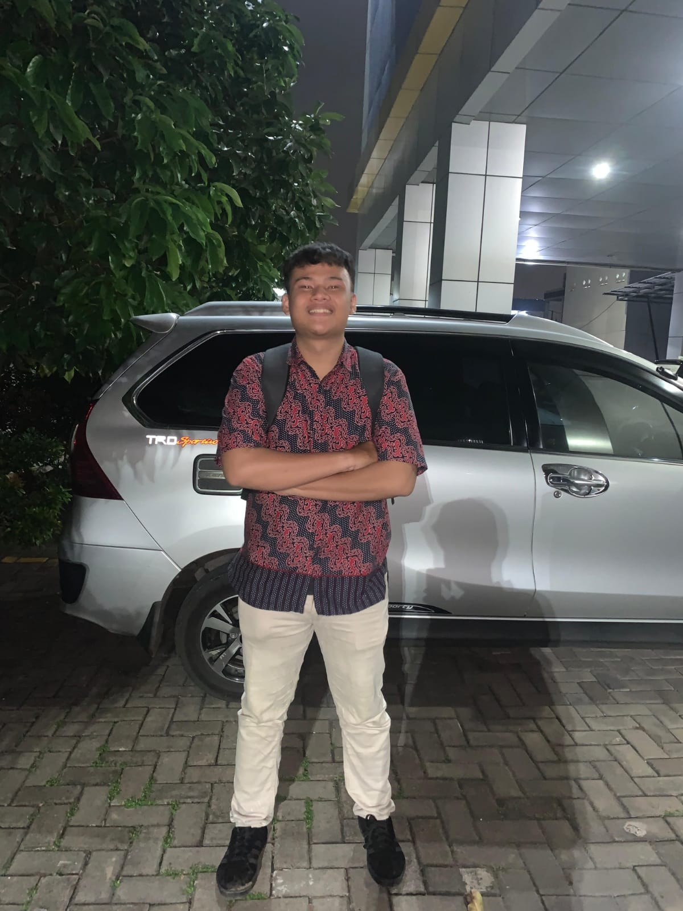

[index.html](https://github.com/user-attachments/files/27097178/index.html)
# portfolio-miftahul
web
<!doctype html>
<html lang="id">

  <head>
    <meta charset="UTF-8" />
    <title>Portfolio - Muhammad Miftahul Khair</title>

    <!-- ICON (WA, IG, YT) -->
    

    
  </head>

  <body>
    <!-- NAVBAR -->
    <nav>
      <ul>
        <li><a href="#home">Home</a></li>
        <li><a href="#about">About</a></li>
        <li><a href="#contact">Contact</a></li>
      </ul>
    </nav>

    <!-- HEADER -->
    <header id="home">
      
      <h1>Muhammad Miftahul Khair</h1>
      
Mahasiswa Ilmu Komputer - Semester 6

    </header>

    <!-- ABOUT -->
    

      <h2>👤 Tentang Saya</h2>
      

        Saya adalah mahasiswa Fakultas Ilmu Komputer di Yatsi Madani yang saat ini sedang menempuh pendidikan pada semester 6. Selama menjalani perkuliahan, saya memiliki ketertarikan yang besar terhadap dunia teknologi, khususnya di bidang
        pemrograman dan pengembangan sistem. Ketertarikan ini mendorong saya untuk terus belajar dan mengasah kemampuan, baik melalui materi perkuliahan maupun eksplorasi mandiri di luar kelas. Saya dikenal sebagai pribadi yang memiliki
        semangat belajar tinggi, disiplin, dan mampu bekerja secara mandiri maupun dalam tim. Dalam proses belajar, saya selalu berusaha memahami konsep secara mendalam serta mengaplikasikannya dalam bentuk proyek nyata, seperti pembuatan
        aplikasi berbasis web dan sistem informasi. Hal ini saya lakukan sebagai bentuk kesiapan dalam menghadapi dunia kerja di bidang teknologi informasi yang terus berkembang.
      

    

    

      <h2>📍 Informasi</h2>
      

        Saya berasal dari Kota Tangerang, sebuah kota yang dikenal dengan perkembangan pesat di bidang industri dan teknologi. Lingkungan tersebut turut membentuk pola pikir saya untuk terus berkembang dan mengikuti kemajuan zaman,
        khususnya dalam bidang teknologi informasi yang saya tekuni saat ini. Saat ini, saya tinggal di Kampung Margasari. Lingkungan tempat tinggal saya memberikan suasana yang nyaman dan sederhana, serta menjadi tempat yang mendukung saya
        untuk fokus dalam belajar dan mengembangkan diri. Dari lingkungan ini, saya juga belajar tentang nilai kebersamaan, kerja keras, dan pentingnya menjaga hubungan baik dengan orang lain. Saya merupakan anak ke-2 dari 3 bersaudara.
        Posisi ini membuat saya belajar untuk menjadi pribadi yang bertanggung jawab, mandiri, serta mampu menjadi penghubung yang baik dalam keluarga.
      

    

    <!-- CONTACT -->
    

      <h2>📞 Kontak</h2>
      
Email: miftahulkhair2677@gmail.com

      

        <!-- WHATSAPP -->
        <a
          href="https://wa.me/08568766753"
          target="_blank"
          class="wa"
        >
          <i class="fab fa-whatsapp"></i> WhatsApp
        </a>

        <!-- INSTAGRAM -->
        <a
          href="https://instagram.com/zherof26"
          target="_blank"
          class="ig"
        >
          <i class="fab fa-instagram"></i> Instagram
        </a>

        <!-- YOUTUBE -->
        <a
          href="https://youtube.com/@MiftahulKhair-l1x"
          target="_blank"
          class="yt"
        >
          <i class="fab fa-youtube"></i> YouTube
        </a>
      

    

    <footer>
      
© 2026 Muhammad Miftahul Khair

    </footer>
  </body>
</html>
